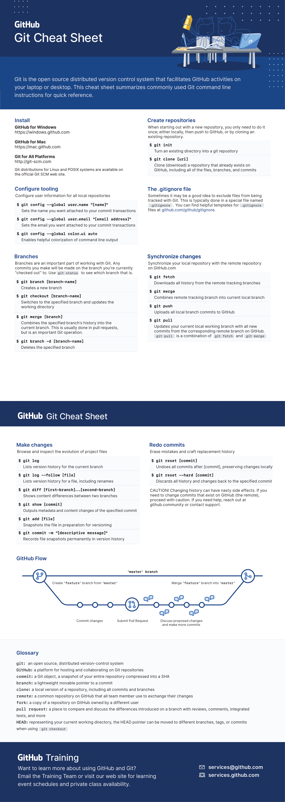

# 💻 Git & GitHub Essentials

This guide helps you get started with Git and GitHub to contribute to HashSlap projects.

## 📚 Key Concepts

- **Git**: A version control system to track code changes.
- **GitHub**: A platform to host and collaborate on code.
- **Pull Request (PR)**: A way to propose changes to a project.

## 🛠 Steps to Make Your First Pull Request

1. **Fork the Repository**: Click "Fork" on the project’s GitHub page.
2. **Clone Locally**: Run `git clone <your-fork-url>` in your terminal.
3. **Create a Branch**: Use `git checkout -b my-feature` to create a new branch.
4. **Make Changes**: Edit files and save your changes.
5. **Commit Changes**: Run `git commit -m "Add my feature"` to commit your changes.
6. **Push to GitHub**: Use `git push origin my-feature` to push your branch.
7. **Submit a Pull Request**: Navigate to the original repo on GitHub and click "New Pull Request."

## 📜 Visual Git Cheat Sheet

## 🔗 Resources

- [Learn Git Branching](https://learngitbranching.js.org/)  
- [First Contributions](https://firstcontributions.github.io/)  
- Practice pull requests in our [practice repository](../practice_repo/README.md)
